<div align="center">

# Law-Nuri

**AI Multi-Agent 법률 토론 Simulator**

*실제 판례와 법률 논리를 기반으로 한 Multi-Agent 법정 Simulation*

<p>
<a href="https://github.com/JHK-DEV-Star/lawnuri/releases/tag/v1.0.0"></a>


</p>

<p>
<a href="#quick-start">Quick Start</a> •
<a href="#usage-guide">Usage Guide</a> •
<a href="#국가법령정보센터-openapi">법률 API</a> •
<a href="#architecture">Architecture</a> •
<a href="#supported-llm-providers">LLM Provider</a>
</p>

</div>

---

## Overview

**Law-Nuri**는 법률 분쟁을 Multi-Agent Simulation으로 돌려보며, 그 과정에서 **실제 판례와 법적 Insight를 수집**하는 AI 법정 토론 Platform입니다.

단순히 LLM에 법률 질문을 던져 하나의 답을 받는 것이 아닙니다. 두 팀의 AI Agent가 실제 판례와 법령을 검색하고 서로 인용·반박하면서 대립 토론을 수행하는 동안, 사용자는 **토론을 관찰하며 쟁점과 관련된 판례·법령·논리의 맥락을 축적**하게 됩니다. 독립된 AI 심판 3명이 법적 추론의 질, 증거의 신뢰성, 논증의 설득력을 다차원으로 평가하고, 모든 검색 결과·내부 Review·인용 근거가 투명하게 기록되므로, 단순한 판결 결과뿐 아니라 **이 쟁점에서 어떤 판례가 어떤 논리로 인용되고, 어떤 판례가 반박되었는가** 까지 한눈에 확인할 수 있습니다.

> **입력**: 상황 설명 + 법률 질문 + 증거 파일 (선택)
>
> **출력**: 실제 판례에 근거한 대립 토론, 판례별 인용·Review·거부 기록, 심판별 판결 및 점수, PDF 보고서

<div align="center">
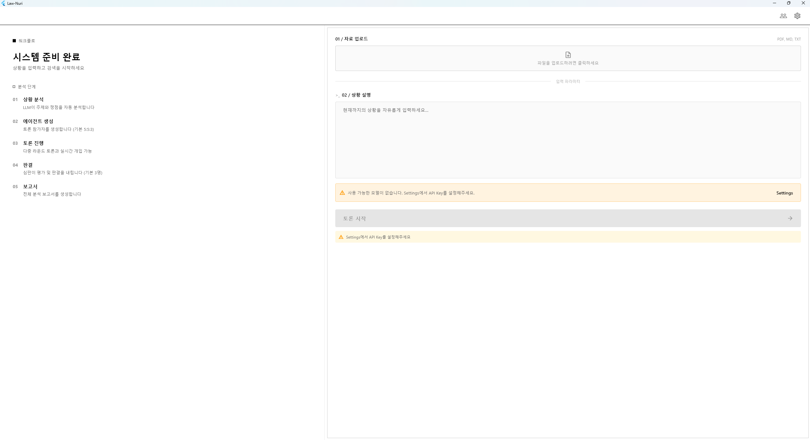
<br><sub><i>상황 입력 및 토론 생성 화면</i></sub>
</div>

<div align="center">
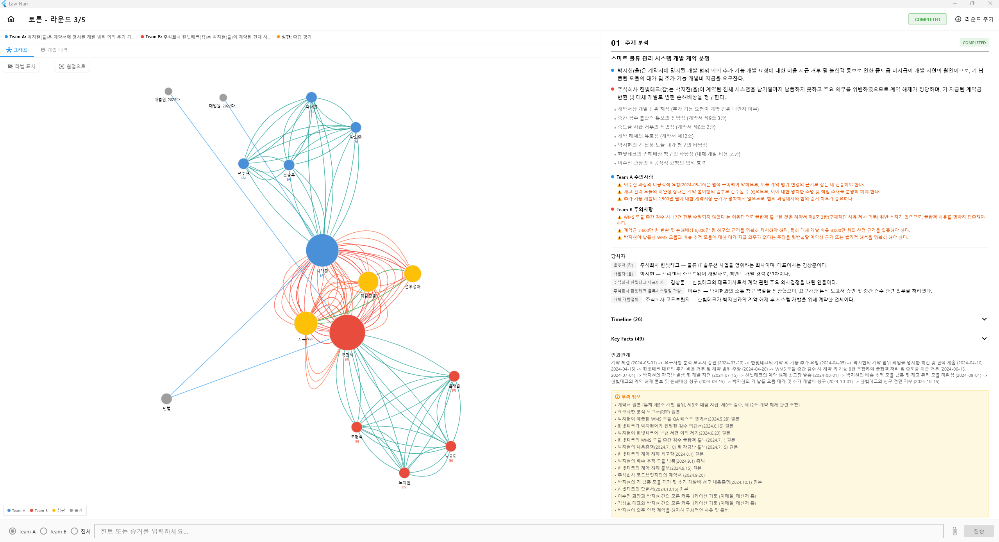
<br><sub><i>AI 상황 분석 결과 — 쟁점 정리, 관련 법률 도출, 양측 입장 구성</i></sub>
</div>

### How It Works

각 팀의 sub-graph는 Round마다 **역할 배정 → 병렬 검색 → 내부 토론 → 발언 생성** 4단계로 동작합니다. 핵심은 세 번째 단계 — Agent들이 검색된 판례를 `ACCEPT / REJECT / REVIEW_MORE` 태그로 투표하여 통과한 판례만 whitelist에 올라가고, 마지막 발언자는 이 whitelist만 볼 수 있어 검증되지 않은 인용이 최종 발언에 유입될 경로를 구조적으로 차단합니다. 검색 결과에 없는 사건번호 인용은 자동으로 탐지·경고됩니다.

심판 sub-graph는 독립적으로 m명의 Agent(기본 3명)가 각 Round를 병렬 평가하고, 최종 Round에서 다차원 점수와 결정적 증거를 산출합니다.

### Why Multi-Agent?

Single LLM은 법률 질문에 대해 종종 **추상적인 원론으로 도피**하거나, **사실 관계를 임의로 왜곡**하거나, **존재하지 않는 판례를 그럴듯하게 지어내는** 문제를 보입니다. Law-Nuri는 이런 약점을 구조적으로 억제하기 위해 Multi-Agent를 채택했습니다. 서로 다른 Agent가 같은 쟁점을 독립적으로 검색·해석하고 팀 내부에서 상호 검증하면, 한 Agent의 모호한 답변이나 사실 왜곡이 다른 Agent의 reject·counter-argument에 걸려 필터링됩니다.

- **Simulation을 통한 Insight 수집**: 토론이 진행되는 동안 쟁점과 관련된 판례·법령이 실시간으로 검색·인용·반박되고, 사용자는 그 전 과정을 관찰하며 법리적 맥락을 자연스럽게 축적
- **대립 구조로 논리의 허점을 발견**: n:n Agent(기본 5:5)가 양쪽 입장에서 논쟁하면서, 한쪽만으로는 보이지 않는 법적 쟁점과 반론을 드러냄
- **팀 내부의 상호 검증**: 같은 팀 Agent들도 서로의 판례 인용을 review·vote·reject할 수 있어, 약한 증거가 최종 발언에 포함되지 않음
- **실제 판례 기반 논증**: 국가법령정보센터 API로 토론 중 실시간으로 관련 판례와 법령을 검색하고, 실제 사건번호와 함께 인용 — 허위 판례는 자동 탐지
- **독립된 심판의 객관적 평가**: m명(기본 3명)의 AI 심판가 각자 legal reasoning, evidence quality, persuasiveness, counter-argument effectiveness를 독립 채점하여 편향 최소화
- **Human-in-the-Loop**: 토론 중 언제든 증거 주입, 팀에 Hint 전달, 일시정지/재개/연장 가능
- **완전한 투명성**: 모든 팀 내부 토론, 검색 Query, 증거 인용, 심판 Note를 추적하고 검토 가능

---

## Features

### Multi-Agent Debate System

- **n:n:m Agent 구조** — 팀당 n명(기본 5명)의 토론 Agent + m명(기본 3명)의 중립 심판 Agent. 팀/심판 수는 설정에서 조정 가능
- **동적 역할 배정** — Round마다 Coordinator, 연구자, 옹호자, 반론자, 종합자 역할을 LLM이 배정
- **Agent별 LLM Override** — 각 Agent가 토론 기본 Model과 다른 Model을 사용 가능
- **팀 내부 토론** — 공개 발언 전 Agent들이 비공개로 전략을 논의하고, 인용할 판례의 적합성을 **투표로 검증** (ACCEPT / REJECT / BLACKLIST / REVIEW_MORE)
- **Review Queue System** — 검색된 판례는 최대 2개씩 pending으로 올라가 Review되며, 처리된 자리는 자동 승격
- **Agent 간 지명 발언** — `[ASK: 이름]` 태그로 특정 팀원에게 다음 발언권을 넘겨 전문 분야에 맞춘 질의 가능
- **심판 질의응답** — 심판 Agent가 토론 도중 양 팀에 질문하여 논증의 근거를 검증

<div align="center">
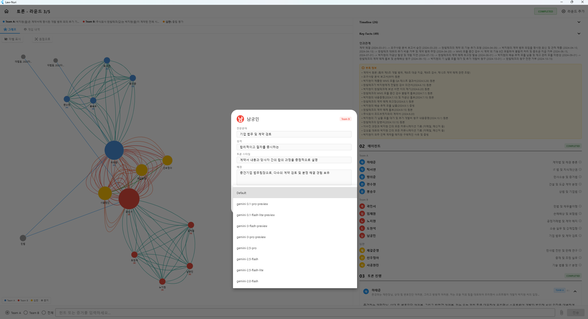
<br><sub><i>Agent 편집 — 전문분야, 성격, 토론 Style, LLM Model Override</i></sub>
</div>

<div align="center">
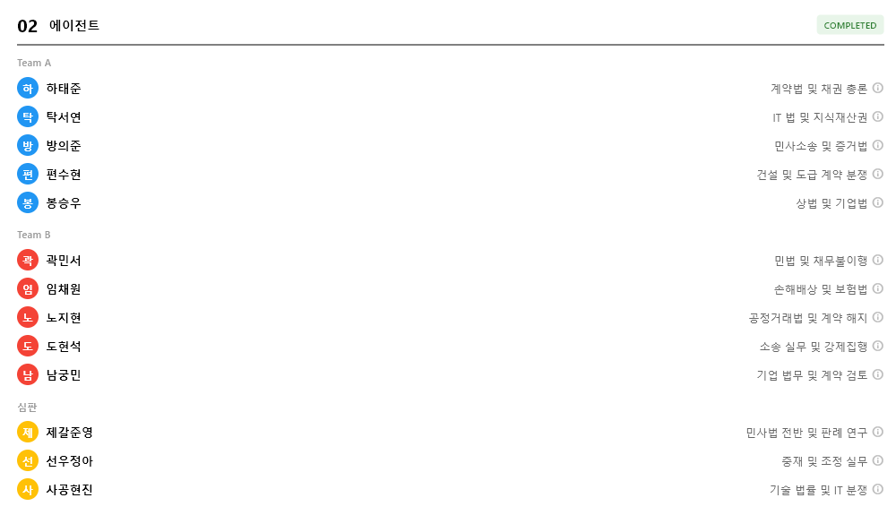
<br><sub><i>Agent 목록 — 팀 A, 팀 B, 심판별 이름과 전문분야</i></sub>
</div>

### Case Law Search (RAG)

- **국가법령정보센터 연동** — 법령, 판례, 헌재결정례 등 14개 법률 Category에서 실제 판례를 실시간 검색
- **판례 관련성 검증** — 검색된 판례가 현재 쟁점과 실질적으로 관련되는지 Multi-Agent가 내부 토론으로 검증
- **문서 Upload** — PDF/TXT/MD 파일을 추가 증거로 Upload
- **Vector 검색** — Embedding 기반 의미 검색으로 판례, 법령, 증거를 탐색
- **지식 graph** — Entity/관계 추출을 통한 구조화된 법률 추론
- **허위 인용 탐지** — 존재하지 않는 판례번호를 자동 감지하고, 심판 Agent가 평가 시 감점 반영

### Debate Control

- **Round 설정** — 최소/최대 Round 수 설정, 심판 조기 종료 투표
- **사용자 개입** — 토론 중 팀에 Hint, 증거, 지시사항 주입
- **일시정지 / 재개 / 연장** — 토론 Lifecycle 전체 제어
- **상태 영속성** — LangGraph Checkpointer가 매 단계마다 상태 저장; Server 재시작 후에도 재개 가능

<div align="center">
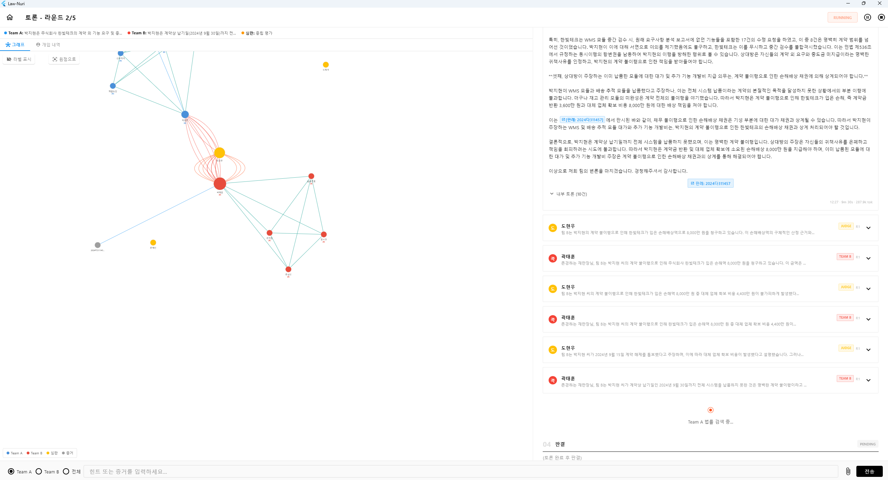
<br><sub><i>실시간 토론 진행 화면 — Round별 발언, 내부 토론, 증거 인용 추적</i></sub>
</div>

<div align="center">
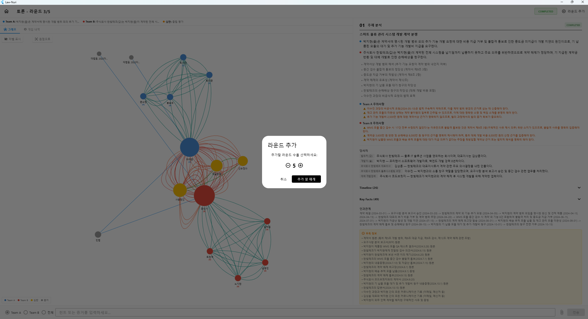
<br><sub><i>Round 연장 — 토론 완료 후 추가 Round를 부여하여 논의 계속</i></sub>
</div>

<div align="center">
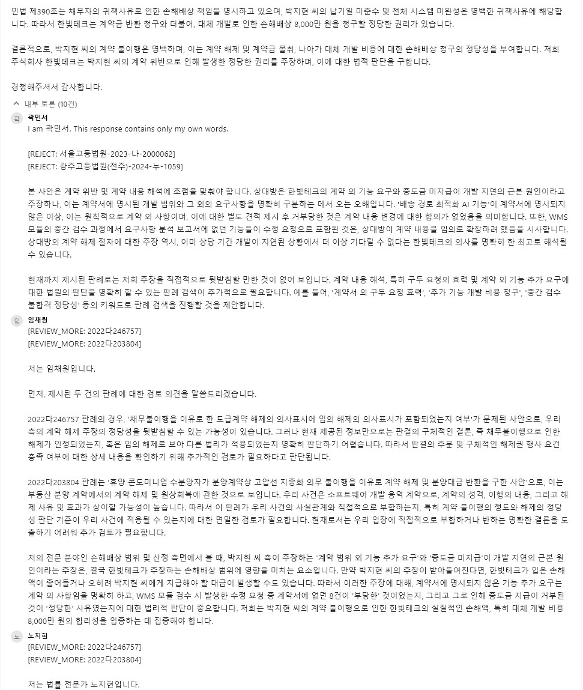
<br><sub><i>팀 내부 토론 — 판례 검증 투표(ACCEPT/REJECT/REVIEW_MORE), 전략 논의, Review Queue</i></sub>
</div>

### Reports & Visualization

- **PDF 보고서** — 토론 종료 후 자동 생성되는 종합 보고서. 다음 항목을 포함합니다:
  - **상황 분석** — 입력된 상황과 AI가 분석한 쟁점 요약
  - **종합 요약** — 토론 전체 흐름과 핵심 결론
  - **핵심 증거** — 판결에 결정적 영향을 미친 판례와 증거
  - **심판 판결** — 각 심판의 독립 판결, 다차원 점수, 판결 이유
  - **논증 분석** — 양측의 논증 전략과 강점/약점 평가
  - **증거 목록** — 토론 중 인용·검증된 모든 판례와 법령
  - **Round별 요약** — Round별 핵심 발언과 전략 변화
  - **권고사항** — AI가 도출한 법적 권고와 유의사항
  - **토론 기록** — 전체 발언, 내부 토론, 투표 기록 원문
- **Interactive graph** — Agent 관계, 반론, 증거 흐름을 보여주는 Force-Directed 토론 graph
- **실시간 Update** — WebSocket을 통해 모든 토론 Event를 UI에 Streaming

<div align="center">
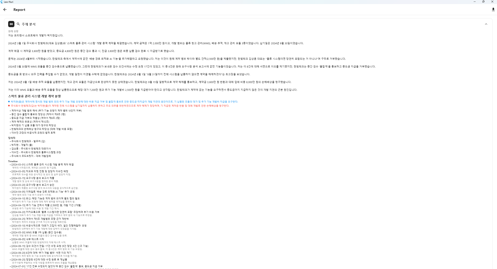
<br><sub><i>PDF 보고서 — 상황 분석, 종합 요약, 핵심 증거, 심판 판결, 논증 분석 등 9개 섹션</i></sub>
</div>

<div align="center">
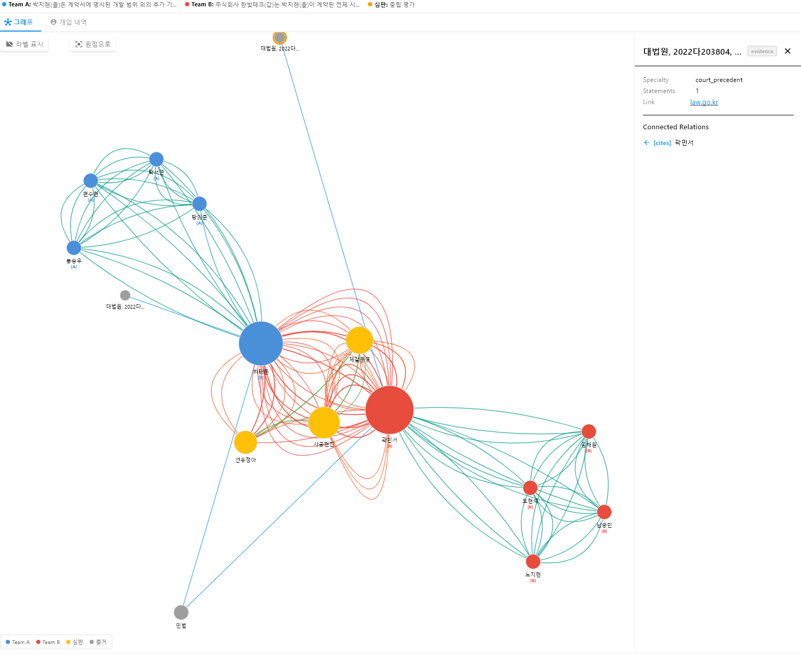
<br><sub><i>Force-Directed 토론 graph — Agent 간 관계 및 증거 흐름 시각화</i></sub>
</div>

### Judgment & Scoring

- **독립 판결** — m명(기본 3명)의 심판 Agent가 각자 독립적으로 판결 및 점수를 부여
- **다차원 평가** — 법적 추론, 증거 품질, 설득력, 반론 효과성 각각 점수화
- **결정적 증거** — 판결에 가장 큰 영향을 미친 핵심 판례와 증거를 명시
- **상세 판결문** — 실제 판례를 참조한 사법적 의견서 형식의 구조화된 판결 이유 제공

<div align="center">
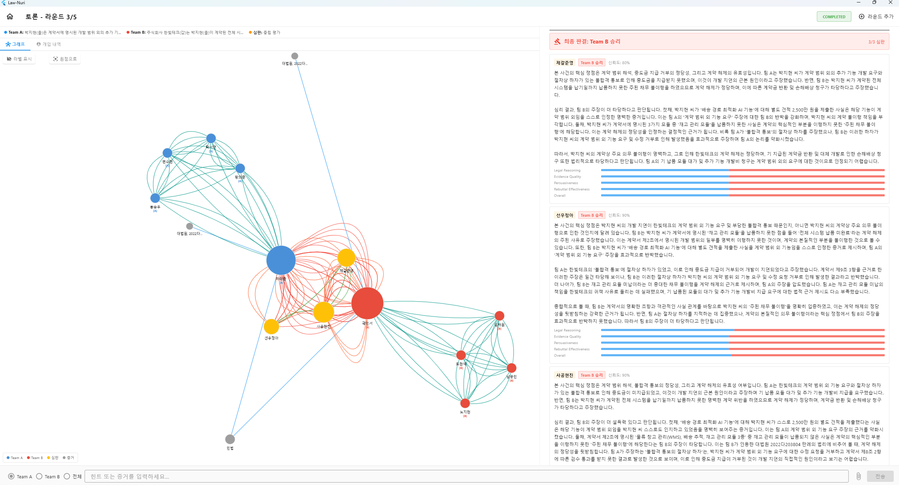
<br><sub><i>심판별 판결 결과 — 점수, 결정적 증거, 판결 이유</i></sub>
</div>

### Multi-Provider LLM Support

- **5개 Provider** — OpenAI, Google Gemini, Anthropic, Vertex AI, Custom (OpenAI 호환)
- **암호화된 API 키** — Fernet 암호화로 자격증명 안전 저장
- **비용 추적** — 설정 화면에서 Model별 가격 표시
- **연결 Test** — 원클릭 Provider 연결 확인

<div align="center">
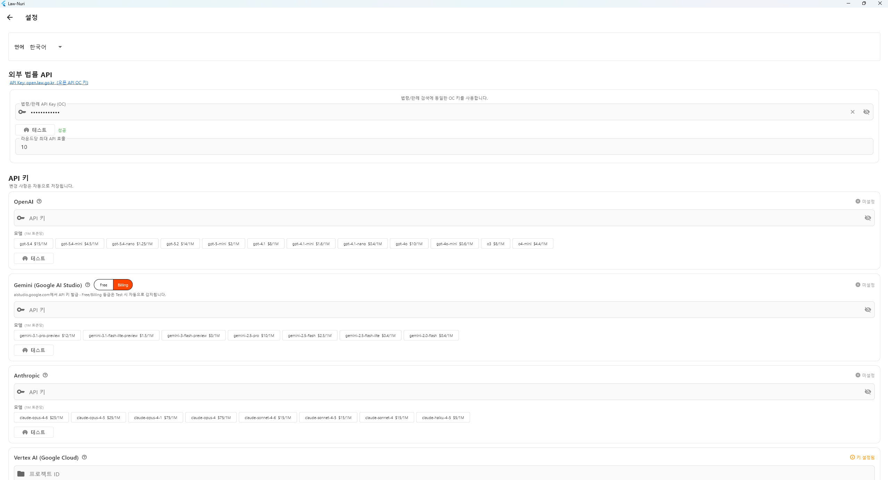
<br><sub><i>LLM Provider 설정 — API 키 관리, Model 선택, 연결 Test</i></sub>
</div>

### Multilingual Support

- **10개 언어** — 한국어, 영어, 일본어, 중국어, 스페인어, 프랑스어, 독일어, 포르투갈어, 베트남어, 태국어

---

## Quick Start

### Download Release (Recommended)

[Download](https://github.com/JHK-DEV-Star/lawnuri/releases/tag/v1.0.0)에서 최신 버전의 `LawNuri.zip`을 Download합니다.

```
LawNuri.zip을 압축 해제하면:

LawNuri/
├── lawnuri.exe                ← 실행 파일 (더블클릭)
├── server/
│   ├── lawnuri_server.exe     ← Backend Server (자동 실행됨)
│   ├── .env                   ← Server Port 설정
│   └── data/                  ← Data 저장 경로
└── ...                        ← 기타 DLL, Resource
```

**실행:**

1. `lawnuri.exe`를 더블클릭합니다
2. Backend Server(`server/lawnuri_server.exe`)가 자동으로 시작됩니다
3. 앱이 열리면 **설정** 화면에서 LLM API 키를 등록합니다

> **참고**: Release는 현재 Windows 전용입니다.

### Run from Source

Python 3.11+ 와 Flutter 3.10+ 가 설치되어 있어야 합니다.

```bash
setup.bat
```

Backend venv 생성 + 의존성 설치 + Flutter Package fetch 가 자동으로 실행됩니다. 완료 후 두 개의 Terminal에서 각각 Backend와 Frontend를 실행합니다 (안내가 setup.bat 마지막에 출력됩니다).

---

## Usage Guide

### Step 1. LLM Provider Setup

앱을 처음 실행하면 **설정** 화면으로 이동합니다.

1. 사용할 LLM Provider를 선택합니다 (OpenAI, Gemini, Anthropic, Vertex AI, Custom)
2. API 키를 입력합니다 — 키는 Fernet 암호화로 로컬에 저장됩니다
3. **Test** 버튼으로 연결을 확인합니다
4. 토론에 사용할 기본 Model을 선택합니다

설정은 `backend/data/settings.json`에 저장됩니다. Release 버전에서는 `server/data/settings.json` 경로입니다. 모든 API 키는 Fernet 대칭키로 암호화되어 저장됩니다.

### Step 2. Legal Search Setup (Optional)

국가법령정보센터 API 키를 등록하면 토론 중 실시간 판례 검색이 활성화됩니다.

- API 키 발급: [법령정보 공동활용](https://open.law.go.kr/LSO/openApi/guideList.do)
- 설정 화면에서 **법률 API** 섹션에 키를 입력합니다
- 키 없이도 토론은 정상 진행되지만, Agent가 실제 판례를 인용하지 못합니다

### Step 3. Create Debate

**홈 화면**에서 토론을 생성합니다.

1. **상황 설명**: 법적 분쟁의 구체적 맥락을 입력합니다
2. **법률 질문**: 판단이 필요한 핵심 쟁점을 입력합니다
3. **증거 파일** (선택): PDF, TXT, MD 파일을 Upload합니다 (최대 50MB)

입력 예시:
```
상황: 갑은 을 회사에서 5년간 근무한 직원이다. 갑은 회사 기밀 문서를
개인 이메일로 전송한 사실이 적발되어 즉시 해고되었다. 갑은 해당
문서가 개인 업무 참고용이었으며, 외부 유출 목적이 아니었다고 주장한다.
해고 사유서에는 "회사 기밀 유출"로 기재되어 있다.

질문: 이 해고가 정당한 해고인가, 부당해고인가?
```

**토론 시작** 버튼을 누르면 LLM이 상황을 분석하고 양 팀의 Agent Profile을 자동 생성합니다.

### Step 4. Review Agent Setup

생성된 Agent Profile을 확인하고 필요시 편집합니다.

- 각 Agent의 성격, 전문분야, 토론 Style을 수정할 수 있습니다
- 특정 Agent에 다른 LLM Model을 지정할 수 있습니다 (Agent별 LLM Override)

### Step 5. Run & Observe Debate

**시작** 버튼을 누르면 토론이 진행됩니다.

각 Round는 다음 순서로 진행됩니다:

```
Team A 검색 → Team A 내부 토론 → Team A 발언
         ↓
    심판 Memo 축적
         ↓
Team B 검색 → Team B 내부 토론 → Team B 반론
         ↓
    심판 평가 + 조기 종료 투표
```

토론 중 가능한 조작:

| 조작 | 설명 |
|------|------|
| **Hint 전달** | 특정 팀에 논증 방향을 제안 |
| **증거 주입** | 새로운 증거를 토론에 추가 |
| **일시정지** | 토론 일시 중단 |
| **재개** | 일시정지된 토론 재개 |
| **연장** | 최대 Round 수 추가 |
| **중지** | 토론 즉시 종료 |

### Step 6. Judgment & Report

토론이 끝나면 m명의 심판(기본 3명)가 독립적으로 판결을 내립니다.

- **판결 화면**: 심판별 승패 판정, 점수, 결정적 증거, 판결 이유를 확인합니다
- **PDF 보고서**: 전체 토론 기록, 증거 목록, 논증 분석, 판결문이 포함된 보고서를 Download합니다

---

## 국가법령정보센터 OpenAPI

Law-Nuri는 [국가법령정보센터](https://www.law.go.kr) OpenAPI를 통해 토론 중 실시간으로 법률 Data를 검색합니다.

**API 키 발급**: [법령정보 공동활용 신청](https://open.law.go.kr/LSO/openApi/guideList.do)

### Supported Categories

| Category | 설명 |
|---------|------|
| **법령** | 법률, 시행령, 시행규칙 (국가 법령) |
| **판례** | 대법원, 고등법원, 지방법원 판례 |
| **헌재결정례** | 헌법재판소 결정례 |
| **법령해석례** | 법제처 법령 유권해석 |
| **행정심판재결례** | 행정심판위원회 재결 |
| **자치법규** | 지방자치단체 조례, 규칙 |
| **행정규칙** | 훈령, 예규, 고시, 공고 |
| **조약** | 국제 조약 및 협정 |
| **법령용어** | 법률 용어 정의 |
| **특별행정심판** | 특별행정심판 재결례 |
| **사전컨설팅** | 감사원 사전컨설팅 의견 |
| **중앙부처해석** | 중앙부처 1차 법령해석 |
| **별표서식** | 법령 별표 및 서식 |
| **위원회결정문** | 각종 위원회 결정문 |

### How It Works

1. 토론 중 Agent가 현재 쟁점과 관련된 Keyword로 법률 Data를 자동 검색합니다
2. 검색된 판례는 실제 사건번호(예: `2023다12345`)와 함께 인용됩니다
3. 존재하지 않는 판례번호를 인용하면 허위 인용으로 자동 탐지되어 증거 점수에 Penalty가 부여됩니다
4. 검색 결과는 SQLite에 로컬 Caching되어 동일한 검색에 대한 중복 API 호출을 최소화합니다
---

## Workflow

<div align="center">
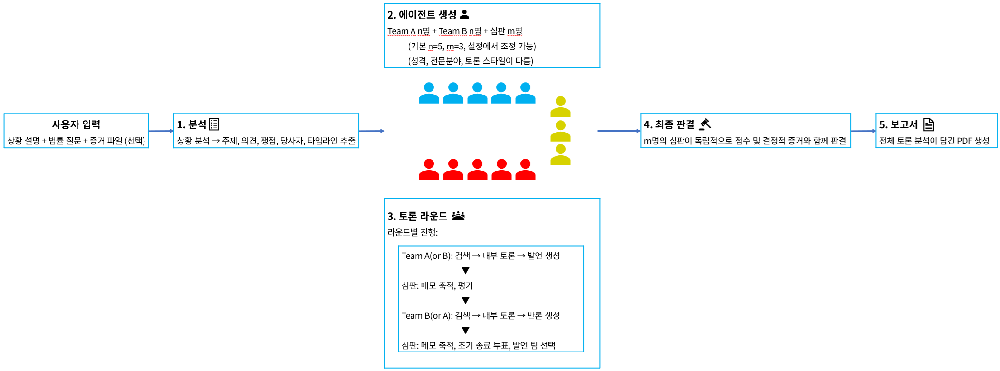
<br><sub><i>End-to-end pipeline: Input → Analysis → Agent Generation → Debate Rounds → Final Judgment → Report</i></sub>
</div>

---

## Architecture

```
Law-Nuri/
├── app/                          # Flutter Desktop Frontend
│   └── lib/
│       ├── screens/              # 홈, 토론, 판결, 보고서, 설정
│       ├── providers/            # Riverpod 상태 관리
│       ├── api/                  # HTTP + WebSocket Client
│       ├── widgets/              # graph 시각화, Timeline 등
│       └── l10n/                 # 10개 언어 문자열 Registry
│
└── backend/                      # FastAPI + LangGraph Backend
    └── app/
        ├── api/                  # REST Endpoint + WebSocket
        ├── graph/                # LangGraph 상태 머신
        │   ├── main_graph.py     # 토론 Orchestration graph
        │   ├── nodes/            # team_speak, judge, final_judgment...
        │   └── edges/            # 조건부 Routing Logic
        ├── agents/               # System Prompt Builder
        ├── rag/                  # 법률 API, Vector 검색, 지식 graph
        ├── db/                   # SQLite 리포지토리
        └── utils/                # LLM Client, Embedding, 재시도 Logic
```

| 계층 | 기술 |
|------|------|
| Frontend | Flutter 3.10+ (Desktop: Windows, macOS, Linux) |
| 상태 관리 | Riverpod |
| Backend | FastAPI + Uvicorn |
| Orchestration | LangGraph (Agent 상태 머신) |
| Database | SQLite (aiosqlite) |
| Vector 저장소 | ChromaDB / SQLite |
| LLM Interface | OpenAI SDK (Multi-Provider) |
| PDF 생성 | fpdf2 |
| 실시간 통신 | WebSocket |

---

## Configuration

모든 설정은 앱의 **설정 화면**에서 관리합니다. 환경 변수나 설정 파일을 직접 편집할 필요가 없습니다.

### Settings File Location

| 배포 형태 | 경로 |
|-----------|------|
| Release (exe) | `server/data/settings.json` |
| 소스 빌드 | `backend/data/settings.json` |

### LLM Provider Setup

설정 화면에서 Provider를 추가하고 관리합니다:

1. Provider 선택 (OpenAI, Gemini, Anthropic, Vertex AI)
2. API 키 입력 → **Test** 버튼으로 연결 확인
3. 사용할 Model 선택

Custom Provider를 추가하면 OpenAI 호환 API를 제공하는 모든 Service를 사용할 수 있습니다 (예: Ollama, LM Studio, Together AI).

---

## Supported LLM Providers

| Provider | Model | 가격 (1M Token 기준) |
|-----------|------|-------------------|
| **OpenAI** | GPT-5.4, GPT-4.1, GPT-4o, o3, o4-mini | $0.10 ~ $15.00 |
| **Gemini** | gemini-3.1-pro, gemini-2.5-flash, gemini-2.0-flash | $0.10 ~ $12.00 |
| **Anthropic** | claude-opus-4-6, claude-sonnet-4-5, claude-haiku-4-5 | $1.00 ~ $25.00 |
| **Vertex AI** | Google Cloud를 통한 Gemini Model | $0.10 ~ $12.00 |
| **Custom** | OpenAI 호환 Endpoint | 사용자 정의 |

모든 Provider는 설정 UI에서 구성합니다. API 키는 암호화되어 저장됩니다.

---

## Notes

- **LLM API 비용**: 토론마다 LLM API 호출이 발생합니다. 기본 구성(n=5) 기준 총 13개 Agent(5+5+3)가 Round마다 발언하며, 팀 크기를 늘리면 호출 수도 비례해서 증가합니다. 5 Round 토론 기준 수십~수백 회의 API 호출이 발생할 수 있으니 사용량과 비용을 주의하세요.
- **한국 법률 전용**: 국가법령정보센터 API는 대한민국 법률 Data만 제공합니다. 다른 국가의 법률은 지원하지 않습니다.
- **Windows Release**: Release 실행 파일은 현재 Windows 전용입니다. macOS/Linux는 소스에서 빌드해야 합니다.
- **Server 종료 시**: Server가 종료되면 진행 중인 토론은 자동으로 `stopped` 상태로 변경됩니다.

---

## Disclaimer

Law-Nuri는 AI 기반 법률 토론 Simulation 도구이며, **법률 자문이나 법적 조언을 제공하지 않습니다.** 본 프로그램의 출력물(토론 내용, 판결, 보고서 등)은 AI Agent가 생성한 것으로, 실제 법률 전문가의 판단을 대체할 수 없습니다. 법적 분쟁이나 의사결정에는 반드시 자격을 갖춘 법률 전문가와 상담하시기 바랍니다.

---

## License

이 프로젝트는 [Apache License 2.0](LICENSE) 하에 배포됩니다.
